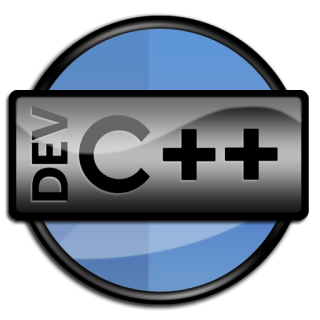
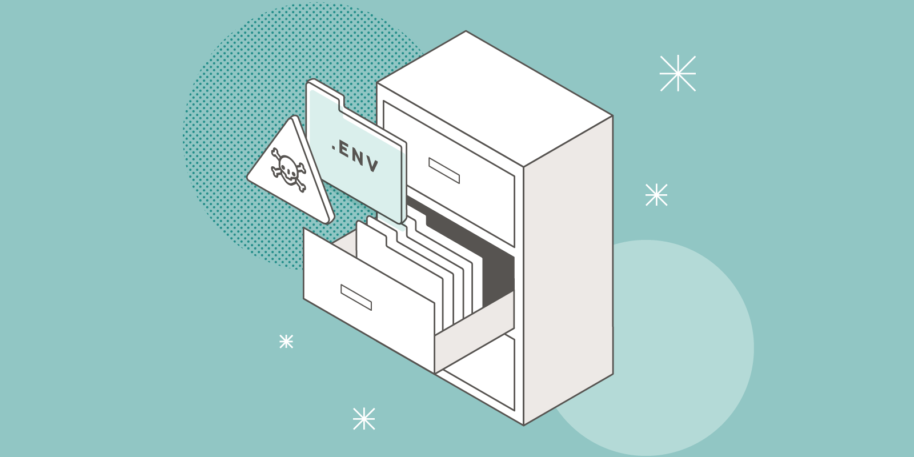
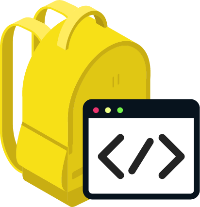
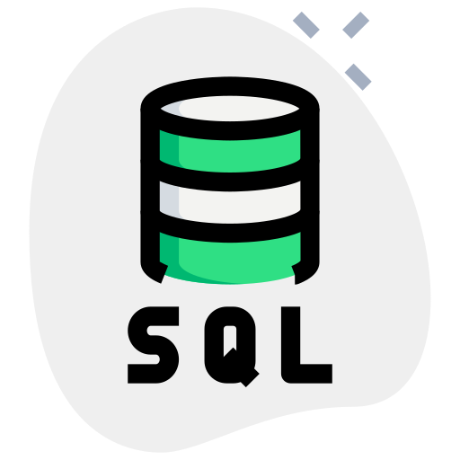
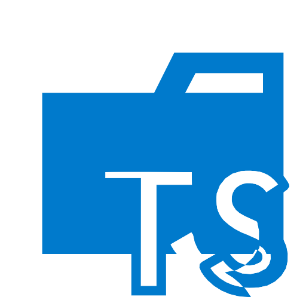
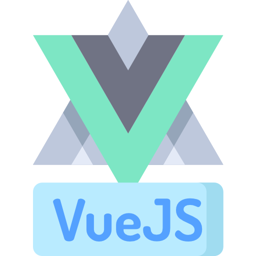

# VSCode Packs

## Introduction

This is a repository for VS Code extensions categorized into packs, you will find all extensions under these categories:

*  Base Development Tools Pack
*  C++ Pack
*  Data Pack
*  Docker Pack
*  dotENV Pack
*  Git Pack
*  HTML & CSS Pack
*  Java Pack
*  JavaScript Pack
*  JSON Pack
*  Laravel Pack
*  Markdown Pack
*  Node.js Pack
*  NPM Pack
*  PHP Pack
*  Productivity Pack
*  Python Pack
*  React Pack
*  Remote Pack
*  Sass Pack
*  SQL Pack
*  Support Pack
*  Test Pack
*  Themes Pack
*  TypeScript Pack
*  Vue.js Pack

## Update the packs

If you want to update the pack (add new ext, remove old ext, change the order, change the assets, etc), then you have to do that:

* [ ] Open the pack in new window as a project.
* [ ] Do the changes
* [ ] Update the `CHANGELOG` file.
* [ ] Update the version number in `package.json` file.
* [ ] Generate the new `.vsix` file (using CLI, or task runner).

## Deploy the packs

As a further step, all the packs will be deployed to the [Visual Studio | Marketplace](https://marketplace.visualstudio.com/), and will be published on [Github](https://github.com).

## Conclusion

In deployment stage, I will be entered the Open-source community for the first time! :boom:
I love building tools that make developers productive! :computer:
