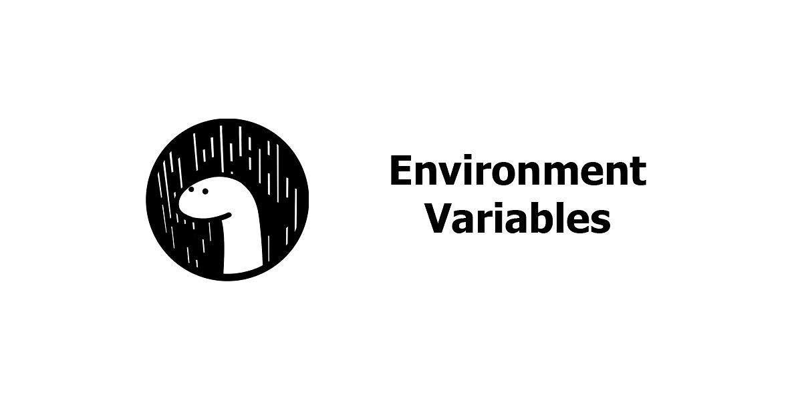

# VSCode dotENV Pack

This extension pack adds more features to VS Code! These are some of my favorite extensions to make dotENV editing easier and fun.

The best dotENV extensions for Visual Studio Code are now available as a single package, so you don't have to manually install them one by one.

I love building tools that make developers productive!

The **VSCode dotENV** pack includes:

* [.ENV Switcher](https://marketplace.visualstudio.com/items?itemName=EcksDy.env-switcher)
* [DotENV](https://marketplace.visualstudio.com/items?itemName=mikestead.dotenv)
* [sync-env](https://marketplace.visualstudio.com/items?itemName=dongido.sync-env)

**Enjoy!**
