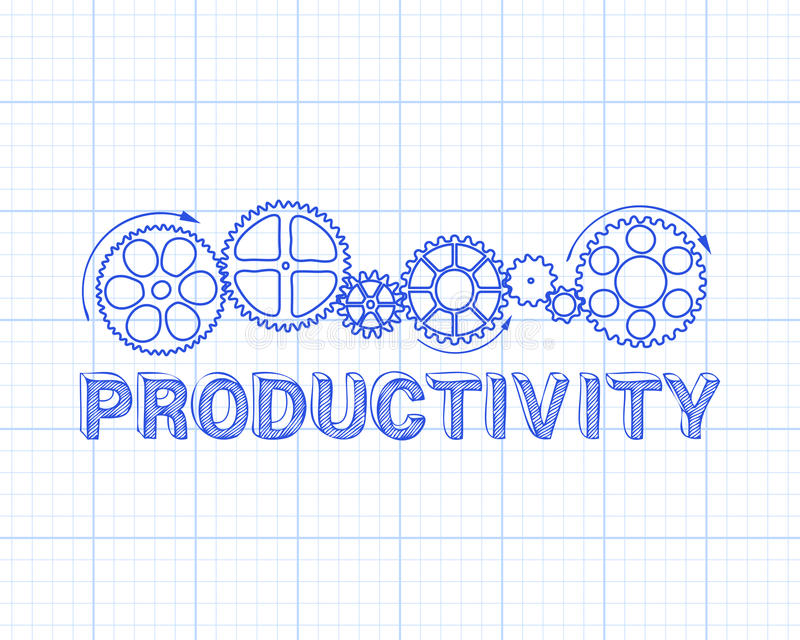

# VSCode Productivity Pack

This extension pack adds more features to VS Code! These are some of my favorite extensions to make Productivity working easier and fun.

The best Productivity extensions for Visual Studio Code are now available as a single package, so you don't have to manually install them one by one.

I love building tools that make developers productive!

The **VSCode Productivity** pack includes:

* [CodeTour](https://marketplace.visualstudio.com/items?itemName=vsls-contrib.codetour)
* [dendron](https://marketplace.visualstudio.com/items?itemName=dendron.dendron)
* [GitKraken Boards](https://marketplace.visualstudio.com/items?itemName=axosoft.gitkraken-glo)
* [Issue tracker in IDE: integrates with Jira, Linear, GitHub, Slack, and more](https://marketplace.visualstudio.com/items?itemName=Stepsize.stepsize)
* [Live Share](https://marketplace.visualstudio.com/items?itemName=ms-vsliveshare.vsliveshare)
* [Pomodoro](https://marketplace.visualstudio.com/items?itemName=cosminalco.pomodoro)
* [Project Dashboard](https://marketplace.visualstudio.com/items?itemName=kruemelkatze.vscode-dashboard)

**Enjoy!**
