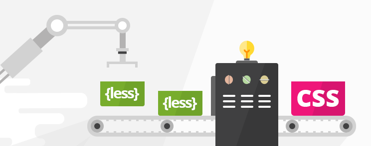

# VSCode JavaScript Pack

This extension pack adds more features to VS Code! These are some of my favorite extensions to make JavaScript editing easier and fun.

The best JavaScript extensions for Visual Studio Code are now available as a single package, so you don't have to manually install them one by one.

I love building tools that make developers productive!

The **VSCode JavaScript** pack includes:

* [Beautify css/sass/scss/less](https://marketplace.visualstudio.com/items?itemName=michelemelluso.code-beautifier)
* [Live Sass Compiler](https://marketplace.visualstudio.com/items?itemName=glenn2223.live-sass)
* [Sass](https://marketplace.visualstudio.com/items?itemName=syler.sass-indented)
* [Sass/Less/Stylus/Pug/Jade/Typescript/Javascript Compile Hero Pro](https://marketplace.visualstudio.com/items?itemName=Wscats.eno)
* [SCSS IntelliSense](https://marketplace.visualstudio.com/items?itemName=mrmlnc.vscode-scss)

**Enjoy!**
