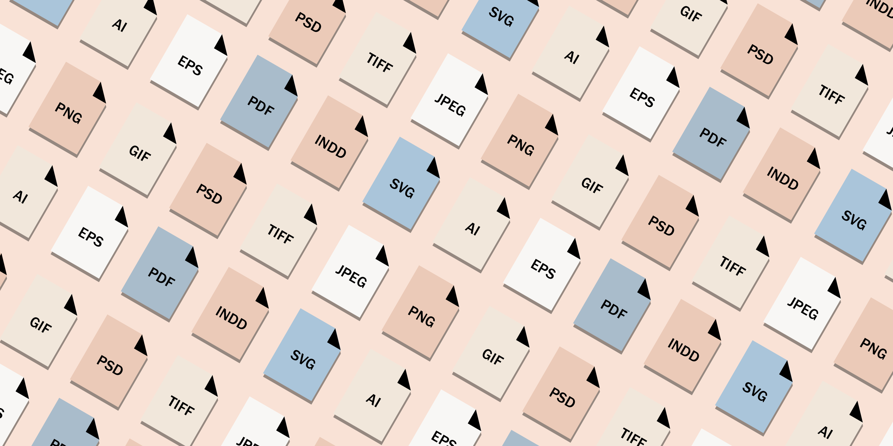

# VSCode Support Pack

This extension pack adds more features to VS Code! These are some of my favorite extensions to make Support files easier and fun.

The best Support extensions for Visual Studio Code are now available as a single package, so you don't have to manually install them one by one.

I love building tools that make developers productive!

The **VSCode Support** pack includes:

* [Better Shell Syntax](https://marketplace.visualstudio.com/items?itemName=jeff-hykin.better-shellscript-syntax)
* [Better TOML](https://marketplace.visualstudio.com/items?itemName=bungcip.better-toml)
* [NGINX Configuration](https://marketplace.visualstudio.com/items?itemName=william-voyek.vscode-nginx)
* [nginx.conf hint](https://marketplace.visualstudio.com/items?itemName=hangxingliu.vscode-nginx-conf-hint)
* [shell-format](https://marketplace.visualstudio.com/items?itemName=foxundermoon.shell-format)
* [XML](https://marketplace.visualstudio.com/items?itemName=redhat.vscode-xml)
* [YAML](https://marketplace.visualstudio.com/items?itemName=redhat.vscode-yaml)

**Enjoy!**
