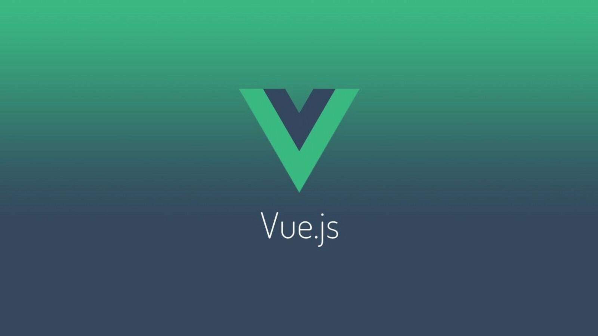

# VSCode Vue.js Pack

This extension pack adds more features to VS Code! These are some of my favorite extensions to make Vue.js editing easier and fun.

The best Vue.js extensions for Visual Studio Code are now available as a single package, so you don't have to manually install them one by one.

I love building tools that make developers productive!

The **VSCode Vue.js** pack includes:

* [Vue 3 Snippets](https://marketplace.visualstudio.com/items?itemName=hollowtree.vue-snippets)
* [Vue Language Features (Volar)](https://marketplace.visualstudio.com/items?itemName=Vue.volar)
* [Vue Peek](https://marketplace.visualstudio.com/items?itemName=dariofuzinato.vue-peek)
* [Vue Theme](https://marketplace.visualstudio.com/items?itemName=mariorodeghiero.vue-theme)
* [Vue VSCode Snippets](https://marketplace.visualstudio.com/items?itemName=sdras.vue-vscode-snippets)
* [vue-component](https://marketplace.visualstudio.com/items?itemName=zhubincong.vue-component)
* [Vue.js AutoImport](https://marketplace.visualstudio.com/items?itemName=ishiyama.vue-autoimport)

**Enjoy!**
